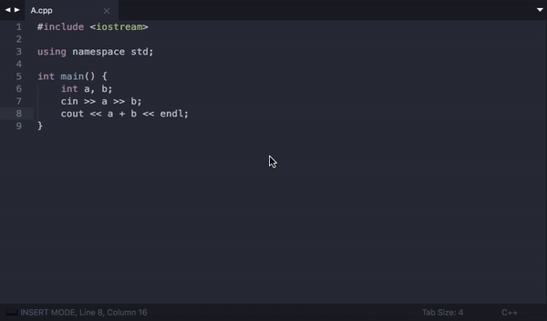
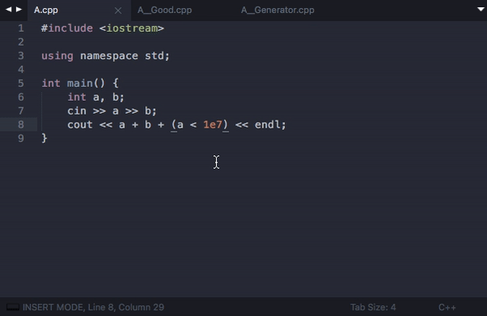
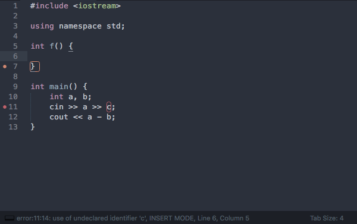
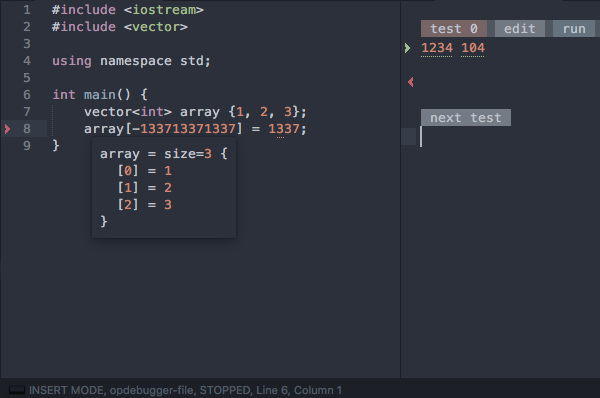

Fast Olympic Coding plugin for Sublime Text 3
================
 * [Installation](#installation)
 * [Test Manager](#testmanager)
 * [Settings](#settings)
 * [Stress Testing](#stresstesting)
 * [Class Completion](#classcompletion)
 * [C++ Lint](#cpplint)
 * [Debugger](#debugger)
 
### Installation
 * Install via [Package Control](https://packagecontrol.io/packages/CppFastOlympicCoding)
 * Install manually: 
       [download plugin](https://github.com/Jatana/FastOlympicCoding/archive/master.zip) into packages (`Preferences — Browse packages...`) 
       `Warning! rename plugin folder to FastOlympicCoding`

### TestManager
 
#### TestManager Keybindings
 * <kbd>ctrl+b (OSX)</kbd> <kbd>ctrl+alt+b (Linux + Win)</kbd> compile and run
 * <kbd>ctrl+enter</kbd> new test
 * <kbd>ctrl+c (OSX)</kbd>  <kbd>ctrl+x (Linux + Win)</kbd> kill process
 * <kbd>ctrl+shift+b (OSX)</kbd> run with debugger
 * <kbd>ctrl+d</kbd> delete test
 * <kbd>ctrl+super+up/ctrl+super+down (OSX)</kbd> <kbd>ctrl+shift+up/ctrl+shift+down (Linux + Win)</kbd> swap tests
 * <kbd>cmd+k, cmd+p (OSX)</kbd> <kbd>ctrl+k, ctrl+p (Linux + Win)</kbd> close/open right panel

### Settings
 * To edit settings
   * press <kbd>cmd+shift+p (OSX)</kbd> <kbd>ctrl+shift+p (Linux + Win)</kbd> and type `FastOlympicCoding: Open Settings`
   * or `Preferences — Package Settings — FastOlympicCoding`

### StressTesting
 
 
 * To stress test a solution, you need to implement the three following files:
   * `<name>.cpp` - program that works incorrect
   * `<name>__Good.cpp` - program that works correct
   * `<name>__Generator.cpp` - program that generates tests, you can read a seed for a random generator in the input
 * then type `FastOlympicCoding: Make Stress` in command palette to run and `FastOlympicCoding: Stop Stress` to stop stress test

### ClassCompletion
 

 * Type aliases to substitute them with data types
 * Customize aliases in the settings file

### CppLint
 
 
 * Error highlighting works in real-time
 * Specify custom compile command in the settings file
 
### Debugger
 

 * debugger only for OSX
 * <kbd>ctrl+shift+b</kbd> to run with debugger
 * point the cursor on a variable to see its value
 * to select a stack frame (type `FastOlympicCoding: Select Frame` in command palette)
 * the only one dependency is xcode (you can install it with `xcode-select --install`)

